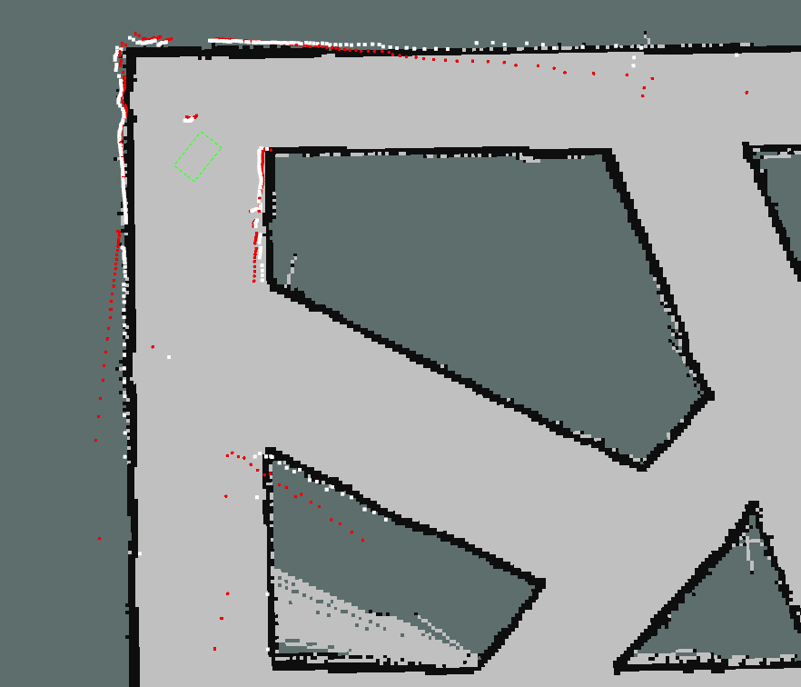

# lidar_undistortion_2d

a ros package for lidar motion compensation

## Introduction

读取odom数据对2D激光雷达数据进行运动畸变校正。

This ros package uses odom transform data to correct motion distortion of a 2D LIDAR in real time。

## Result



在图片中，黄色方框代表机器人的位姿，红色点云代表原始的激光雷达数据，白色方框代表经过运动补偿后的激光雷达数据。

in this picture, the yellow rectangle represents the pose of robot, the red poindcloud represents the origin lidar data, and the white pointcloud represents the lidar data after compensation.

## Parameters in launch file

名称 | 类型 |  注释
-------- | ----- | -----
scan_sub_topic | string | 订阅的激光数据话题名
scan_pub_topic  | string | 经过运动畸变矫正后发布的激光数据话题名
enable_pub_pointcloud  | bool | 是否将校正后的数据重新封装为LaserScan消息发布
pointcloud_pub_topic | bool | 经过运动畸变矫正重新封装LaserScan消息话题名
lidar_frame| string | 激光雷达数据的坐标系
odom_frame | string | Odometry数据的坐标系
lidar_scan_time_gain | double | 激光雷达单次扫描时间系数

## Test with rosbag
1. compile the project and `source devel/setup.sh`
2. execute the following command
```
roslaunch lidar_undistortion_2d test_lidar_undistortion_2d.launch enable_undistortion:=true
```
3. find `/bag/sensor_data.bag`
```
rosbag play --clock sensor_data.bag
```
4. result 

the gif showed below represents location with orign lidar data.


the gif showed below represents location with undistortion lidar data.


## Reference

https://github.com/elewu/2d_lidar_undistortion

深蓝学院SLAM教程
